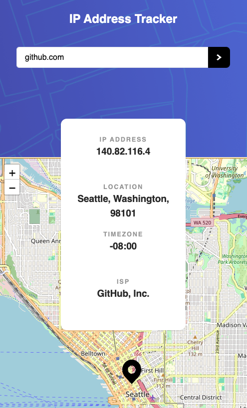

# Frontend Mentor - IP address tracker solution

This is a solution to the [IP address tracker challenge on Frontend Mentor](https://www.frontendmentor.io/challenges/ip-address-tracker-I8-0yYAH0). Frontend Mentor challenges help you improve your coding skills by building realistic projects.

## Table of contents

- [Overview](#overview)
  - [The challenge](#the-challenge)
  - [Screenshot](#screenshot)
  - [Links](#links)
- [My process](#my-process)
  - [Built with](#built-with)
  - [What I learned](#what-i-learned)
  - [Continued development](#continued-development)
  - [Useful resources](#useful-resources)
- [Author](#author)
- [Acknowledgments](#acknowledgments)

## Overview

### The challenge

Users should be able to:

- View the optimal layout for each page depending on their device's screen size
- See hover states for all interactive elements on the page
- See their own IP address on the map on the initial page load
- Search for any IP addresses or domains and see the key information and location

### Screenshot

### Links

- Solution URL: [Add solution URL here](https://your-solution-url.com)
- Live Site URL: [Add live site URL here](https://margaux-works.github.io/ip-address-tracker/)

## My process

### Built with

- Semantic HTML5 markup
- [React](https://reactjs.org/) - JS library
- [Vite](https://vite.dev/) - frontend build tool
- [Ipify](https://www.ipify.org/) - IP Address API
- [LeaftLet](https://leafletjs.com/) - JS library for maps
- [Tailwind CSS](https://tailwindcss.com/) - CSS framework
- CSS Grid
- Flexbox
- Mobile-first workflow

### What I learned

- integration of LeaftLet library
- some more practice with Tailwind CSS
- how to deploy a Vite React app on gh-pages, thanks to this [article](https://medium.com/@devxprite/how-to-deploy-vite-react-app-to-github-pages-00e150f73961)

### Useful resources

- [How to deploy a Vite React App on GitHub pages](https://medium.com/@devxprite/how-to-deploy-vite-react-app-to-github-pages-00e150f73961)
- [How to securely store API keys](https://www.freecodecamp.org/news/how-to-securely-store-api-keys-4ff3ea19ebda/)

## Author

- Frontend Mentor - [@yourusername](https://www.frontendmentor.io/profile/margaux-works)
- GitHub - [margaux-works](https://github.com/margaux-works)
